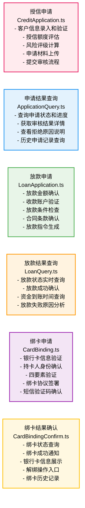

# 流程定义卡片图

## 流程说明

### 1. 授信申请 (粉色卡片)
- **文件**: CreditApplication.ts
- **功能**: 客户信息录入和验证、授信额度评估、风险评级计算、申请材料上传、提交审核流程

### 2. 申请结果查询 (蓝色卡片)
- **文件**: ApplicationQuery.ts
- **功能**: 查询申请状态和进度、获取审核结果详情、查看拒绝原因说明、历史申请记录查询

### 3. 放款申请 (绿色卡片)
- **文件**: LoanApplication.ts
- **功能**: 放款金额确认、收款账户验证、放款条件检查、合同条款确认、放款指令生成

### 4. 放款结果查询 (橙色卡片)
- **文件**: LoanQuery.ts
- **功能**: 放款状态实时查询、放款成功确认、资金到账时间查询、放款失败原因分析

### 5. 绑卡申请 (紫色卡片)
- **文件**: CardBinding.ts
- **功能**: 银行卡信息验证、持卡人身份确认、四要素验证、绑卡协议签署、短信验证码确认

### 6. 绑卡结果确认 (黄色卡片)
- **文件**: CardBindingConfirm.ts
- **功能**: 绑卡状态查询、绑卡成功通知、银行卡信息展示、解绑操作入口、绑卡历史记录
